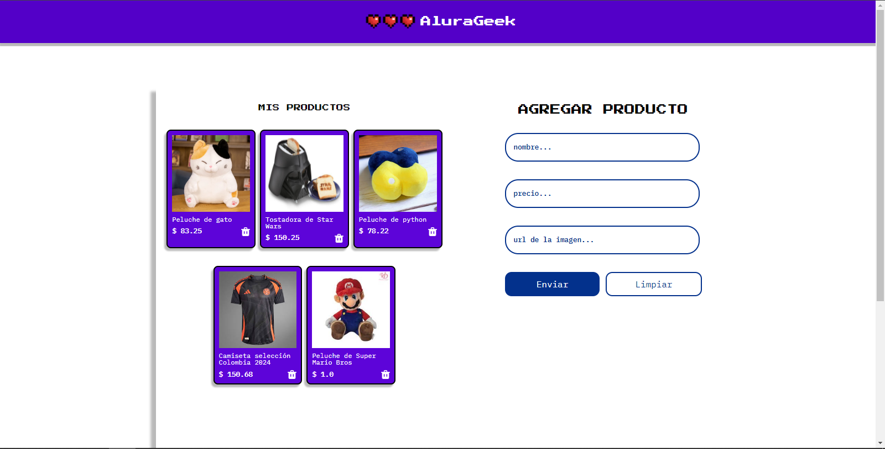

<div align="center">
  <h1 align="center">
    Challenge AluraGeek
    <br />
    <br />
    <a href="https://github.com/SantiagoBulla/AluraGeek">
      
    </a>
  </h1>
</div>

## Introduction

AluraGeek is a Front end project, built with HTML, CSS and JavaScript. It aims to demonstrate the skills acquired in the **Front End G6 - ONE** course. 

### **Features**

> AluraGeek allows user interaction through the creation, deletion and visualization of a product catalog.

> Asynchronous concepts are worked emulating the communication with a fake API, executed through json-server.

> Responsive design techniques are implemented within the construction of the user interface.

## Installation

Use the initialization CLI to install the project dependencies:

```bash
npm install
```

## Project execution

> 1. Use the initialization CLI to run the json-server service:

    ```bash
    npx json-server db.json --watch
    ```
> 2. Use the live server extension to run the index file and view the front end or open the index.html file in your favorite browser.


## Contact

The project was developed by Santiago Bulla:

- [Github](https://github.com/SantiagoBulla): SantiagoBulla
- [linkedIn](https://www.linkedin.com/in/santiagobullaperez/) santiagobullaperez

## Sponsors

- [Alura Latam](https://www.linkedin.com/company/alura-latam/): Alura Latam
- [ONE](https://www.oracle.com/co/education/oracle-next-education/) Oracle Next Education (ONE)

